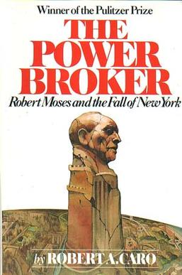

+++
title = 'The Power Broker'
date = 2026-04-04
draft = false
+++

**[The Power Broker: Robert Moses and the Fall of New York](https://en.wikipedia.org/wiki/The_Power_Broker)** by Robert A. Caro

I'm reading the book with Luthan. The book has 7 parts, 50 chapters, ~1,162 pages. We're aiming for ~100–150 pages per week.

The current plan is in the table below. We're doing a book discussion weekly, with notes in the next section after the table below.

If you want to join, please let us know (contact me through my email, or twitter account).

| Week | Date | Chapters | Pages | Part | Status |
|------|------|----------|-------|------|--------|
| 1 | 05 April 2026 | Intro + 1–3 | 1–58 | I. The Idealist | Done |
| 2 | 12 April 2026 | 4–7 | 59–135 | II–III | Done |
| 3 | 19 April 2026 | 8–11 | 136–xx | III. The Rise to Power | Reading |
| 4 | 26 April 2026 | 12–14 | xx–259 | IV. The Use of Power | Upcoming |
| 5 | 03 May 2026 | 15–17 | 260–322 | IV | Upcoming |
| 6 | 10 May 2026 | 18–20 | 323–401 | IV | Upcoming |
| 7 | 17 May 2026 | 21–23 | 402–467 | IV | Upcoming |
| 8 | 24 May 2026 | 24–25 | 468–575 | IV–V | Upcoming |
| 9 | 31 May 2026 | 26–28 | 576–638 | V. The Love of Power | Upcoming |
| 10 | 07 June 2026 | 29–32 | 639–702 | VI. The Lust for Power | Upcoming |
| 11 | 14 June 2026 | 33–34 | 703–806 | VI | Upcoming |
| 12 | 21 June 2026 | 35–37 | 807–884 | VI | Upcoming |
| 13 | 28 June 2026 | 38–40 | 885–960 | VI | Upcoming |
| 14 | 05 July 2026 | 41–43 | 961–1025 | VII. The Loss of Power | Upcoming |
| 15 | 12 July 2026 | 44–46 | 1026–1081 | VII | Upcoming |
| 16 | 19 July 2026 | 47–50 | 1082–1162 | VII | Upcoming |

## Notes

### Week 1 — Introduction + Chapters 1–3

*Discussed Sunday, 06 April 2026. Present: Faw, Luthan, Nobu, Ghani.*

**Key threads:**

1. **Arrogance and idealism: separable?** The group leaned toward "yes, but you walk a very thin line." Nobu argued that some willingness to not listen to others is necessary to displace 500,000 people from the Bronx, and that elitism itself is more necessary than the specific racial contempt Moses developed. He distinguished between the Oxford-era Anglo-imperial arrogance (contempt toward colonial subjects) and the more general elitism that drives large-scale vision. Luthan framed it through white man's burden and social Darwinism, noting that for Moses's generation this wasn't understood as arrogance but as the natural order. Ghani noted that the contempt is toward characteristics, not people personally. Faw raised a paper about how compassion for the poor requires insulation from the poor, and wondered how historically justifiable social Darwinism was in the early 1900s given that "we live in the future where it turned out to be mostly wrong."

2. **Institution-building from the margins.** At Yale, Moses couldn't enter the real power structure (no Skull and Bones, no Vanderbilt Hall) so he built his own through the Kit Cat Club, the Courant, and minor sports. Nobu suggested Moses's institution-building wasn't strategic but emerged from rejection: "the rejection is what made him start building." He also argued that at Yale, Moses wasn't political at all, that it was "pure force of will." Faw pushed back that this presupposes Moses wanted to build influence, whereas his overriding motive was idealism. Luthan reframed the question as simply: how do outsiders end up with disproportionate influence? Faw tried to find Indonesian parallels (Suharto, Jokowi) but found them imperfect. The group noted Jokowi 2014 vs Jokowi 2019 as "two completely different people."

3. **The Oxford thesis and elite education.** Moses's rigid upper/lower civil service division led to a long discussion about credentialism, legibility, and educational lineage. Nobu made the point that modern mass education's usefulness comes from its legibility across large populations, which makes it hard to have non-legible systems like liberal arts schooling. He also observed that "a non-small part of this education is socialization within an intimate club" and that actual content is secondary. Nobu further argued that Indonesia's Dutch-based educational lineage (built for nationalism and bureaucratic competence) is solving a fundamentally different problem than the Anglo model (which was originally about producing clergymen and lawyers). Luthan asked the more idealistic question: how do you make this kind of education available to everyone? Ghani saw Moses's meritocracy push as more self-serving than idealistic, noting that competence-based systems were "more achievable for him" given that the existing patronage system locked him out.

4. **Pre-WWI optimism and historical naivety.** Nobu contextualized Moses's generation through the long European peace before WWI, arguing there was "a great sense of complacency" among elites who were grandchildren of those who maintained that peace, though he wasn't sure how much this transferred to America. Faw confirmed that Caro explicitly connects this to the spirit of the age that fueled Progressive-era reform movements.

5. **Moses as European, not American.** Nobu flagged how surprisingly European Moses is: the Grand Tour, Venice, Oxford, swimming with the Khedive of Egypt. He expressed "a great sadness" that Moses's pet project was highways rather than transit, connecting it to Moses's racial attitudes, and wanted to read further to understand how much of the highway project was racially motivated versus idealism-based. Faw agreed he expected a "quintessentially American" figure but found someone "super into the old world." Nobu observed that the Yale class of 1909's elite was still essentially European aristocracy, and that the "American" image we hold is very post-WWII, making Western grievances about lost culture more salient when you see that culture still existed in 1900.

**What we admire about Moses (closing round):**
- **Faw:** His erudition, breadth of knowledge, and ambition.
- **Luthan:** His intellectual bravery. At the Oxford Race Congress, even though Luthan disagreed with what Moses said, he admired that Moses just stated his position and accepted the consequences.
- **Ghani:** The realization that negative emotions, including arrogance, can be productively channeled to make the world better. A way to distill Moses' thinking: when you know you're competent and you see incompetent people coalescing against you, you have justification to destroy them. "Justified, productive anger."
- **Nobu:** How European he still is. "As the person who shapes New York, I wish he were more of a New Yorker." Also the question of how much of "New Yorker" as an identity was actually created by Moses's tenure.

**Format note:** The group decided future discussions should be less question-driven and more passage-driven. Highlight interesting or funny passages during the week, then discuss those. Discussions will be one hour, Saturday mornings at 10 WIB.

here's my draft — i matched the week 1 format and voice as closely as i could. obviously edit for accuracy where i misread the indonesian or misattributed something.

---

### Week 2 — Chapters 4–7

*Discussed Saturday, 12 April 2026. Present: Faw, Luthan, Nobu, Guntur.*

**Key threads:**

1. **The invention of good governance.** The group was struck by how recently basic governance technologies were invented — municipal budgets, line-item accounting, org charts. Nobu and Faw shared the same initial reaction: surprise at how *new* these concepts are. Guntur came at it from the opposite direction: he was surprised at how *old* they are, given that Indonesia is still struggling with the same problems a century later. Nobu raised the point that the language of good governance has since been captured by opponents of reform — terms like "efficiency" and "business-like government" now carry negative connotations in public service discourse. He argued that it's harder to implement good governance today than in the 1920s precisely because the opposition has learned to speak the reformers' language. Faw noted that the Bureau of Municipal Research stopped investigating once its allies gained power under Mayor Mitchel, and that 47 inspectors were appointed without examination by a reformer from his own organization — suggesting that reform identity may be inherently unstable once reformers hold power.

2. **The Progressive theory of change: knowledge versus power.** The Progressives believed that if citizens simply knew the facts about government, they would act correctly. Moses believed the same thing. Guntur argued that creating knowledgeable citizens is still valuable in the long run, pointing to the growth of citizen initiatives in Indonesia post-reformasi, even ones that don't pursue formal power. Faw pushed the China counter-example hard: a political entity where citizens are not encouraged to know anything about their government, yet the government delivers prosperity and responsiveness. The group debated at length. Nobu and Guntur argued that China's model requires "the right person" (a Deng Xiaoping), and that the human cost of getting the wrong person — 80 million dead in a decade — is the price of removing democratic safety valves. Nobu framed the core function of democracy not as optimizing output per unit time, but as optimizing for "not killing millions of people when policy fails." Faw distilled, "we don't optimize for output, we optimize for not killing everyone when mistakes become national agendas."

3. **Moses the Calvinist efficiency expert and Indonesian parallels.** Moses designed a system where every government job is broken into functions, each given a mathematical weight, each graded arithmetically. He called an examiner who considers the "human factor" a "dangerous man." Guntur provided a striking parallel from current Indonesian civil service reform: the jabatan fungsional (functional position) system was recently compressed from 10 levels to 3, which meant demoting existing employees and cutting their tunjangan (allowances). Everyone refused. The compromise — applying the new system only to new hires — is *exactly* what Moskowitz proposed and Moses rejected in chapter 5. Faw observed that Moses insisted on applying the system to all employees, old and new, which is what made it politically unviable. The group discussed how Indonesia's current push toward single-salary rationalization is essentially the same reform impulse cycling through different eras, with Nobu noting that the private sector itself has moved away from hyper-rationalized pay structures as work became less repetitive and more knowledge-based.

4. **Federalism as laboratory.** Nobu made the case that one structural advantage the U.S. had over Indonesia is state-level experimentation. Al Smith's consolidation of executive power across sixteen departments could be tried in New York without requiring every state to follow. In Indonesia, reforms to local government effectively require nationwide adoption, making the political ask enormously harder. Faw agreed, noting that the absence of experimentation space also removes safety valves against bad actors in the system. Nobu extended this, without local counterbalances, a single corrupt pattern can overrun the entire structure.

5. **Tammany's counter-strategy and Indonesian resonance.** Tammany never openly opposed reform — they demanded "individual consideration," packed hearings with sympathetic stories, stalled, and waited. Guntur drew a parallel to the 17+8 demands presented to the DPR, where the pattern was identical: acceptance in principle, public hearings, then no progress. Nobu observed that the Indonesian case is in some ways the inverse of Moses's problem: whereas Moses-era reformers were too zealous and refused compromise, Indonesian technocratic reformers (like those in KPPOD) are already hyper-compromising from the outset, yet still achieve nothing. Faw suggested the difference may be that Indonesian reformers lack the public backing that enabled early American Progressives to adopt uncompromising postures — they're forced to soften their proposals so much that the reforms become harmless to the interests they're meant to challenge.

6. **Bella Moskowitz: results over headlines.** The group discussed Bella Moskowitz's political shrewdness — her ability to choose which battles to fight, her willingness to compromise tactically, and her orientation toward results rather than purity. Faw described her as someone who "would've been a great effective altruist." The key question: what made her the exception among Progressives? Faw argued that political shrewdness is a learnable skill, not an innate trait, and that the real question the book raises is how people acquire it rapidly enough to outplay entrenched machines like Tammany Hall. Faw admitted disappointment with himself for discovering that Moses and Moskowitz also relied on "executive support" as their theory of change — the same framework he'd criticized as non-explanatory. The group debated whether one's aspiration to play a Bella Moskowitz role inside Indonesian government is viable, given that whatever such operators build is tethered to the executive they serve — once that figure is gone, the network either transfers or disintegrates.

7. **Moses's management style.** "REVISE ALL!" scrawled across reports. Large angry double question marks. "Most essential question not discussed at all." But also: infectious laughter, charm, directness. His staffers looked back on working for him as a high point despite being unpaid for weeks. Faw admired the combination of extreme demands and egalitarian energy — Moses asked more of himself than of his staff, and his frankness made people feel they were on the same side. Guntur related this to his own workplace frustrations: leaders who can't make decisions in 30-minute meetings, leaving everyone drained. The group acknowledged that this style of relentless drive for results is part of what eventually justifies Moses's later authoritarian turn — if inefficiency costs this much, the temptation to bypass democratic process becomes enormous.

8. **Moses's transformation: corruption arc or awakening?** By chapter 7, Moses is openly scornful of reformers who care about accuracy. When allies point out that Al Smith is making factual misstatements, Moses laughs: "We know that. But it sounds a hell of a lot better this way, doesn't it?" He destroyed the New York State Association's nonpartisan credibility by turning it into a Smith campaign vehicle. The group debated whether this is corruption or simply learning something true about power that other reformers refused to accept. Nobu argued it was a "calculated adoption of the rules of the game" — Moses wanted to build parks so badly that he chose leverage over purity. Faw observed that the speed of Moses's learning proves that power is a skill, not an innate quality, and that someone naturally excellent at learning will naturally excel at wielding power. The group agreed this is both the book's most fascinating insight and its most terrifying: The Power Broker reads as a cautionary tale if you want to be a good person, and as an instruction manual if you want to get things done.

9. **Al Smith's self-education.** Briefly discussed. Smith read every bill introduced in the Legislature, studied law books past midnight, and read the entire annual appropriations bill — something no one had ever done. Faw contrasted Smith's method (bottom-up mastery of legislative machinery) with Moses's Oxford education (top-down rationalist system design). Both mastered government, but through completely opposite approaches. The group noted the irony that Smith — the Tammany product — developed a more empirically grounded understanding of government than Moses the reformer.

**Others:**

- I'm also creating a souvenir for attendees of W2's meeting. It's a bracelet with a text on it, "What Would Bob Moses Do?". Pics to come.

<!-- Template for weekly notes:

### Week N — Chapters X–Y

**Key passages:**

**Discussion questions:**

-->
